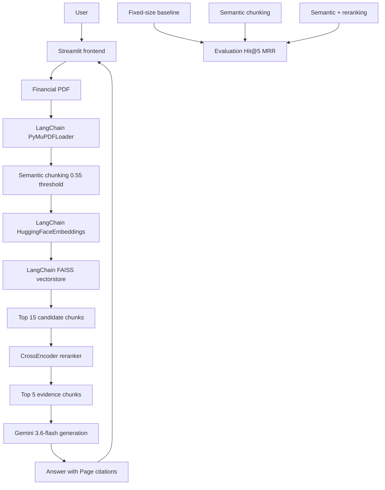

# Investment Research Assistant
### Primer
*My RAG app helps investment researchers answer risk, financial-performance, and disclosure questions from a company's Form 10-K filing in a Streamlit chat interface, with page-cited, evidence-grounded answers (100% Hit@5 retrieval accuracy on evaluated queries).*

# Investment Research Assistant
### Primer
*My RAG app helps investment researchers answer risk, financial-performance, and disclosure questions from a company's Form 10-K filing in a Streamlit chat interface, with page-cited, evidence-grounded answers (100% Hit@5 retrieval accuracy on evaluated queries).*
### Framework
| Field | Details |
|---|---|
| **Use case** | An investor or analyst asks natural-language questions about a financial filing (risks, revenue, margins, competition) via a chat UI and gets a concise answer grounded in the source document. |
| **Corpus** | A single Form 10-K PDF at a time (developed against Apple's 2025 10-K, ~80 pages), uploaded per session — English, text-based SEC filings. |
| **Ingestion + cleaning** | PDF text is extracted page-by-page via LangChain's PyMuPDFLoader; whitespace is stripped, page numbers are preserved for citation. |
| **Ingestion + freshness** | Documents are processed fresh on upload — no persistent index; a new filing simply replaces the previous session's index. |
| **Chunking + embedding** | Semantic chunking: sentences are grouped while consecutive-sentence cosine similarity (via all-MiniLM-L6-v2, through LangChain's Embeddings interface) stays above 0.55, capped at 2000 characters per chunk. |
| **Retrieve** | Dense retrieval via LangChain's FAISS vector store: top 15 candidates by cosine similarity, then narrowed to the top 5 by a CrossEncoder reranker before generation. |
### Project Overview
Financial filings are long, dense, and hard to query directly. This project builds a RAG pipeline that lets a user upload a 10-K and ask questions in plain language, getting back answers that are traceable to specific pages — so a claim can always be checked against the source rather than trusted blindly.
The Streamlit interface lets a user upload a filing, watch it get processed into indexed chunks, then ask questions in a chat-style flow. Each answer displays inline page citations as clickable chips, plus an expandable panel showing the exact retrieved evidence text behind the answer — so the retrieval step itself is auditable, not just the final answer.

### Architecture & Why

- **Why LangChain for loading and retrieval:** document loading and vector-store plumbing (FAISS indexing, embedding calls, metadata bookkeeping) are solved problems — reimplementing them by hand added code without adding insight. LangChain's PyMuPDFLoader and FAISS vector store replaced that hand-rolled infrastructure directly.
- **Why semantic chunking (kept, not replaced):** this is the one piece of "custom" logic retained deliberately. We evaluated it against both a fixed-size baseline and LangChain's built-in percentile-based semantic chunker — the fixed-threshold approach outperformed both on this document (see Iterations). Chunking is a genuine design decision here, not boilerplate, so it stayed.
- **Why retrieve broad, then narrow:** embedding similarity is a fast but coarse relevance signal. Pulling 15 candidates first, then reranking with a cross-encoder that scores the query and passage jointly, catches relevant chunks that raw similarity ranks lower — at a fraction of the cost of cross-encoding the whole corpus.
- **Why Gemini for generation:** fast, cheap, and constrained by a strict prompt (see Prompts) to answer only from retrieved evidence — the pipeline's job is to hand it a small, relevant, well-cited context, not to lean on the model's own knowledge.
- **Why page citations:** the target user (an analyst) needs to verify claims against the actual filing, not take the model's word for it — every answer is required to cite [Page X].
- **Why Streamlit:** a lightweight chat interface was enough to demonstrate upload → question → grounded answer without needing a custom frontend.

### Alternatives Considered

| Alternative | Why not chosen |
|---|---|
| Fixed-size chunking (1000 chars / 200 overlap) | Lower ranking quality — MRR 0.713 vs. 0.875 for the final approach; no semantic awareness of sentence boundaries. |
| LangChain's built-in semantic chunker (percentile-based breakpoints) | Measurably regressed retrieval accuracy on this document (Hit@5 dropped to 0.875 from 1.0); the fixed-threshold approach empirically worked better here, so it was kept. |
| Single-pass dense retrieval, no reranking | Lower ranking quality than retrieve-broad-then-rerank (MRR 0.854 vs. 0.875). |
| Fully hand-rolled document loader / vector store | Reinvented infrastructure LangChain already provides cleanly, with no functional benefit over PyMuPDFLoader + LangChain's FAISS integration. |

### Datasets

Apple's 2025 Form 10-K (~80 pages, publicly filed). The pipeline is filing-agnostic — any text-based 10-K can be uploaded.

### Prompts

The generation prompt constrains Gemini to the retrieved context only:

> "Answer the user's question using ONLY the information contained in the provided context... Do not use outside knowledge. Do not invent financial figures or facts. If the context does not contain enough information, clearly say that the available document evidence is insufficient... cite the relevant source page using the format [Page X]."

### Iterations

Chunking strategy was chosen empirically, not by default: a fixed-size baseline, semantic chunking, and semantic chunking + reranking were compared on 8 hand-validated questions. Semantic chunking improved ranking quality over fixed-size chunking, and reranking improved it further — this is why the final pipeline retrieves broad and reranks narrow rather than using a single dense-retrieval pass.

When migrating chunking to LangChain's built-in semantic chunker, retrieval accuracy measurably dropped versus the original fixed-threshold approach (see Alternatives Considered). Rather than accept the regression for the sake of using a framework component, the original chunking logic was kept — now built on LangChain's Embeddings interface so it still shares the same abstraction as the rest of the pipeline.

### Limitations

- Single filing per session — no persistent, multi-document knowledge base.
- No OCR path — scanned or image-only PDFs aren't supported.
- No separate hallucination/faithfulness-checking step; grounding relies on the generation prompt's constraints rather than a dedicated verifier.
- Generation depends on an external Gemini API and its availability.

### Learnings

- Not every pipeline stage benefits from a framework abstraction — chunking strategy is a modeling decision with measurable downstream effects, not interchangeable infrastructure.
- Retrieve-broad-then-rerank is a cheap, meaningful accuracy gain over single-pass dense retrieval.
- A strict, evidence-only generation prompt with mandatory citations is what makes the tool trustworthy enough for financial research, not the choice of LLM itself.
- Investment-Research-Assistant](https://github.com/medha712/Investment-Research-Assistant)
